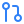
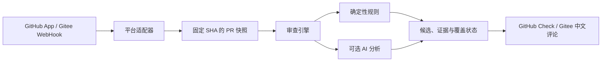

<p align="center">
  
</p>

<h1 align="center">Evidence Review Bot</h1>

<p align="center">
  开源 PR 审查引擎<br>
  <strong>确定性规则 · 可追溯证据 · 审查覆盖率 · 可选 AI 分析</strong>
</p>

<p align="center">
  <a href="LICENSE"></a>
  <a href="https://github.com/ACatNight/evidence-review-bot/actions/workflows/quality.yml?query=branch%3Agithub"></a>
  <a href="package.json"></a>
  <a href="tsconfig.json"></a>
</p>

<p align="center">
  <a href="https://github.com/ACatNight/evidence-review-bot/tree/github"></a>
  <a href="https://gitee.com/mournic/evidence-review-bot/tree/gitee"></a>
</p>

<p align="center">
  <a href="#快速体验">快速体验</a> ·
  <a href="#当前能力">当前能力</a> ·
  <a href="docs/community-onboarding.md">接入指南</a> ·
  <a href="docs/architecture.md">架构设计</a> ·
  <a href="docs/roadmap.md">路线图</a>
</p>

---

Evidence Review Bot 接收平台的 PR 事件，读取固定提交的变更快照，执行审查，并将结果发布回代码托管平台。报告会说明**检查了什么、发现了什么、哪些范围没有完成**。项目正在测试仓库阶段，适合评估报告方式和联调流程；检测效果与生产运行能力尚未经过充分验证。

<table>
  <tr>
    <td width="50%" valign="top">
      
      <strong>确定性规则</strong><br>
      从明确的凭据格式规则开始，记录匹配位置与脱敏候选。
    </td>
    <td width="50%" valign="top">
      
      <strong>证据与快照</strong><br>
      结果绑定具体提交，保留规则、代码位置和证据来源。
    </td>
  </tr>
  <tr>
    <td width="50%" valign="top">
      
      <strong>审查覆盖率</strong><br>
      明确展示已检查范围、部分完成原因与未运行的检查。
    </td>
    <td width="50%" valign="top">
      
      <strong>平台接入</strong><br>
      GitHub Check 与 Gitee 中文 PR 评论，共用审查核心。
    </td>
  </tr>
</table>

## 快速体验

无需数据库、平台账号或 AI 密钥，就能先查看报告格式。需要 Node.js **22.22.2** 和 npm：

```bash
git clone --branch github https://github.com/ACatNight/evidence-review-bot.git
cd evidence-review-bot
npm ci
npm run demo:report -- github
npm run demo:report -- gitee
```

这两个命令生成**离线合成报告**：不读取真实仓库代码，不执行扫描，不连接数据库或模型，也不会发布评论。报告展示候选问题、审查覆盖率、未检查范围和未运行的检查；不能用来判断检测准确率。真实接入请从[社区上手指南](docs/community-onboarding.md)开始。

## 当前能力

| 能力 | 当前状态 | 边界 |
| --- | --- | --- |
| GitHub PR 自动审查 | 已实现测试仓库链路 | GitHub App Webhook、固定 SHA 快照、Check 汇总 |
| Gitee PR 自动审查 | 已实现测试仓库链路 | 仓库 WebHook、固定 SHA 快照、中文 PR 评论报告 |
| 确定性规则 SEC-001 | 已实现 | 仅匹配[列出的 GitHub Token 与 PEM 格式](docs/sec-001-implementation.md)；不验证凭据有效性 |
| AI 安全审查 | 可选，默认关闭 | 仅对授权仓库发送尽力脱敏的变更代码；输出是待人工核实的候选 |
| 审查覆盖率 | 已显示 | 区分已检查、部分完成和未运行；覆盖率不是安全评分或检出率 |
| Lint、构建、测试、依赖审计 | 机器人尚未执行 | 本仓库的 CI 独立运行这些检查，结果不代表目标 PR 已被机器人检查 |
| GitLab、反馈、抑制、回放、完整审计 | 规划中 | 当前没有可供用户启用的实现 |

**零条候选不等于代码安全。** 文件读取失败、超出限制、AI 调用失败和未运行的检查会在报告中体现。SEC-001 也不是通用 Secret 扫描器；规则的格式和漏报边界见[实现说明](docs/sec-001-implementation.md)。

## 工作方式



平台接入、任务处理和报告发布分别实现；领域契约与覆盖计算位于 `src/domain/`，规则位于 `src/rules/`。报告绑定具体提交，并在发布前核对 PR 状态，避免把旧快照的结果误当成当前结果。架构细节见[架构设计](docs/architecture.md)与[数据模型](docs/data-model.md)。

## 接入真实 PR

当前可操作的部署路径是 **Windows 本机试点**。需要 PostgreSQL、Node.js、可供平台访问的 HTTPS Webhook 地址，以及所选平台的授权资料。首次配置后，脚本可构建、迁移并启动 API 与 Worker；它不会代建平台应用、数据库或公网入口。Docker Compose、跨平台安装器和管理界面尚未提供。

1. 按[Windows 部署说明](docs/deployment-windows.md)准备环境，并将密钥文件保存在仓库外。
2. 选择平台：[GitHub App 联调](docs/local-development.md)或[Gitee 仓库接入](docs/gitee-setup.md)。当前启动脚本和 Worker 仍要求 GitHub App 配置，**仅接 Gitee 的部署尚不能独立完成**。
3. 用测试 PR 验证 Webhook 投递、任务执行和报告发布；不要只依据服务健康检查判断接入成功。具体验收步骤见[社区上手指南](docs/community-onboarding.md)。

AI 审查需要单独配置模型服务、密钥文件和允许传输代码的仓库清单。启用外部服务前，请确认仓库代码允许发送到该服务；数据处理边界见[安全说明](docs/security.md)。

## 开发与验证

```bash
npm ci
npm run lint
npm run check
npm test
```

`npm test` 会构建项目并运行测试；部分集成测试需要测试用 PostgreSQL，配置见[本地开发说明](docs/local-development.md)。本仓库的 GitHub Actions 还运行 npm 依赖审计和 CodeQL。这些是**项目自身的质量检查**，不是对接入仓库的 PR 执行的检查。

## 文档

| 从这里开始 | 适合了解 |
| --- | --- |
| [社区上手指南](docs/community-onboarding.md) | 先试读报告，再完成测试仓库联调 |
| [Windows 部署](docs/deployment-windows.md) · [Gitee 接入](docs/gitee-setup.md) | 环境准备、平台配置与真实投递验证 |
| [产品与范围](docs/product.md) · [路线图](docs/roadmap.md) | 目标用户、阶段边界和待完成工作 |
| [架构设计](docs/architecture.md) · [平台接入](docs/platforms.md) | 模块职责、平台适配和发布流程 |
| [SEC-001 边界](docs/sec-001-implementation.md) · [安全与数据处理](docs/security.md) | 规则支持范围、密钥与外部模型数据边界 |
| [竞品与差异化](docs/competition.md) · [评估方案](docs/evaluation.md) | 已知能力重叠、需要实测验证的产品假设 |

更多设计细节见 [`docs/`](docs/)。

## 参与项目

欢迎通过 Issue 提供可复现的错误、部署问题和测试仓库反馈。提交代码前请运行上面的本地检查；涉及检测规则的改动应同时说明正例、反例、误报边界和覆盖变化。安全问题请避免在公开 Issue 中粘贴真实凭据或私有代码。

## 许可证

本项目采用 [Apache License 2.0](LICENSE)。

README 图标来自 [Lucide](https://lucide.dev/)，徽章由 [Shields.io](https://shields.io/) 与 GitHub Actions 提供，技术标识来自 [Simple Icons](https://simpleicons.org/)。图标来源、改动和许可证见[资源说明](docs/assets/README.md)。
