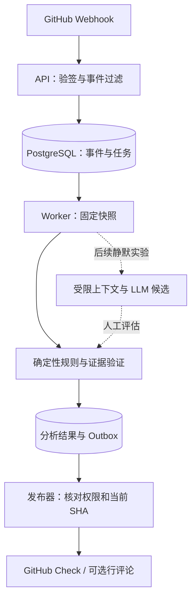

# 架构设计提案

> 状态：讨论稿。本文描述建议的实现边界和运行契约，不代表功能已经实现，也不表示技术选型已由用户确认。

## 1. 目标与首发范围

产品目标是开放、平台无关的 PR Review Engine。首发让审查来源可核查、固定输入下的确定性结果可重跑、发布过程可追溯，并明确说明没有检查到的范围。优先衡量有效评论率、误报率、覆盖率、延迟和每次审查成本。回放不重发评论，也不保证 LLM 重调结果一致；验收见[回放、审计与评估](evaluation.md)。

首版范围以[实施基线](mvp.md)为准：GitHub App、JS/TS 仓库试点、SEC-001 与 Check 汇总。npm 依赖分析在 M3，行评论先在测试仓库验证。Gitee、其他语言或包生态、团队知识、自动修复及多模型路由为后续增量。首版关闭 LLM。

建议采用模块化单体：同一套领域和应用代码，分成 Webhook API 与 Worker 两个进程部署；PostgreSQL 保存业务状态、持久化任务与 outbox。候选技术栈是 TypeScript、Node.js 当前 LTS、Fastify 和 PostgreSQL，具体版本在实施时锁定。选择理由是部署和事务边界简单，同时保留平台、规则和模型适配接口。规模增长后再以实际瓶颈决定是否拆服务或换队列。

## 2. 模块边界

发布器是 Worker 内部模块，不要求另建微服务。图中数据库节点使用同一 PostgreSQL 实例，结果与 outbox 在同一事务提交。

| 模块 | 职责 | 不应承担 |
| --- | --- | --- |
| Platform adapter | 验签、授权、抓取 PR、文件和 diff、平台坐标转换、发布能力声明 | 决定规则结论 |
| Snapshot | 固定本次审查的 base、head、merge-base、文件与 diff 内容 | 使用随时变化的 PR 最新状态代替快照 |
| Rule runner | 以固定输入、规则版本及配置执行确定性检查 | 直接调用平台 API 发布 |
| Context/LLM adapter | 在明确需要时提供有限上下文和候选判断 | 把模型陈述当作已验证事实 |
| Evidence builder | 记录事实、派生步骤、来源和结论关系 | 将敏感原文复制到评论或日志 |
| Publisher | 将 Finding 转为平台支持的输出并回查发布结果 | 假定外部 API 具有事务性 |

核心领域模型使用统一的 `PullRequestSnapshot`、`Finding`、`EvidenceNode`、`Coverage` 和 `PublicationIntent`。平台事件标准化之后，平台差异仍存在于权限、分页、限流、评论坐标和输出能力。适配器应显式报告 capabilities；不支持的能力需要降级，例如无法创建行内评论时改用汇总，而不是让核心层假定所有平台相同。

首版只实现所需的 ScmProvider、受控内置 RulePlugin 和 DEP 阶段的 AdvisorySource 端口，不建立任意第三方插件市场。Review Engine 接收快照与受控分析结果，平台权限仍留在适配层。查看证据、录入反馈、导出审计和无发布副作用的回放可先提供受权限保护的 CLI/API，不以完整管理后台作为首版前置条件。

## 3. 一次审查的生命周期

1. API 使用原始请求体校验 Webhook 签名，验证事件类型、安装与仓库授权，在同一事务保存 delivery ID、必要事件元数据和 snapshot 类型任务，然后快速返回。该任务尚无 run_id。重复 delivery 只更新接收记录，不产生重复任务。
2. Worker 获取当前 PR 的 `base_sha`、`head_sha`，计算 `merge_base_sha`，固定文件列表、补丁和需要的文件内容。快照是不可变输入；内容与 diff 必须对应同一组提交，抓取过程中变更则重新开始或标记失败。快照固定后，在事务中创建或复用 review_run 并调度 analysis 类型任务，同时完成 snapshot 任务。
3. 以 `merge_base_sha..head_sha` 形成审查差异，并保留 `base_sha` 作为当时目标分支状态。三者均记录；merge-base、base 或 head 变化都可能改变审查含义。处理 rename、binary、submodule、过大补丁、截断 diff 和平台文件数限制。
4. 根据规则包版本、配置快照和分析器版本执行确定性规则。仅在规则契约要求且预算允许时获取额外上下文或调用模型。候选结果须经过位置、事实引用及范围验证。
5. 构建 Finding 与证据图，合并重复结果、应用抑制策略，并生成完整性报告。只有定位有效、证据满足规则门槛且达到发布阈值的问题才进入发布意图。
6. 发布前重新读取 PR 当前 head 和 base。若与快照不符，标记本次运行为 `superseded`，不发布旧行内结果，并安排新快照审查。发布后还要记录可能发生的后续变更，不能声称异步系统完全消除竞态。
7. 通过 outbox 发布 Check 和评论，记录外部 ID、请求/响应摘要与审计事件。任何发布失败都保持可恢复状态。

snapshotting 属于前置任务，此时还没有 review_run。运行在固定快照后创建，状态为 `queued → analyzing → publishing → completed`，另有 `failed`、`canceled` 和 `superseded`；重试次数与退避属于 job/intent，不让运行在不同阶段间无依据跳转。replay 模式从 analyzing 直接进入 completed，不创建发布意图。覆盖状态独立为 `complete / partial / not_run`。具体迁移、失败和新鲜度规则以数据模型为准。

## 4. 幂等、重跑与发布

不要用一个键同时代表事件、分析和发布：

- **事件键**：`provider + installation_id + delivery_id`，用于 Webhook 去重。
- **快照键**：`provider + repository_id + pr_id + merge_base_sha + base_sha + head_sha`，用于识别审查输入。
- **分析运行键**：快照键加 `rule_bundle_digest + config_digest + analyzer_version + advisory_snapshot_id`；若使用 LLM，再加入模型与提示模板版本。规则、配置或漏洞库更新可以重跑相同代码快照。运行还需独立 `run_id` 以记录手动重试。
- **Finding 指纹**：仓库、PR、规则、稳定代码位置/语义锚点及问题特征的规范化哈希，用于跨运行关联；不能只依赖行号。
- **发布键**：`provider + repository_id + pr_id + output_channel + run_id + finding_fingerprint`，用于同一运行内的发布意图去重。Check 使用固定的 summary 标识代替 finding_fingerprint。跨运行通过独立发布关联记录找到已有对象，重新分析时明确更新或保留旧评论，不盲目创建。

PostgreSQL 任务队列以 `FOR UPDATE SKIP LOCKED` 领取任务，使用租约、心跳、退避重试和死信/人工检查状态。数据库事务中同时提交分析结果与 outbox 意图；独立发布器领取 outbox。系统提供**至少一次**任务及发布尝试语义。GitHub API 不参与本地事务，超时可能意味着远端已成功；不能承诺 exactly-once。发布重试先依据外部 ID 或隐藏的稳定标记回查，确认不存在后再创建；即使这样也须监测并处理极端重复。

任务领取后立即提交短事务，不在网络请求期间持有数据库行锁。每次重领增加 lease_generation，旧 Worker 的续租、结果提交和发布意图写入都必须校验 generation；租约失效后不得继续写结果。显式重跑创建新 run，基础设施重试复用原 run 并增加 attempt。相同 analysis_key 的自动调度由唯一约束或事务保护，避免同时创建重复运行。

同一 head 下配置更新或显式重跑也会竞争更新同一个 Check。PR 记录 desired_run_id/publish_generation，发布器既核对 SHA，也核对本地期望运行与 generation；按 PR/渠道串行提交更新。已发出的远端请求仍可能晚到，对账器需恢复当前指定运行的结果，不能把本地条件更新当成远端原子保证。

调度不能只依赖 PR head 更新。目标分支推进也可能改变 base/merge-base：适配器在受支持的目标分支更新事件中为相关打开 PR 调度核对，并提供有配额的定期状态对账以补偿漏失事件。具体事件与权限在平台集成阶段验证。

## 5. 规则与证据质量

首发规则优先选择可定义正反例和明确适用范围的检查。Secret 检测需区分真实格式、示例值和测试夹具；不得在日志、数据库证据展示字段或评论中保存完整凭据。依赖漏洞规则应从支持的锁文件确定包名、生态、精确版本、直接/传递依赖，记录 advisory 来源、受影响区间及查询时间。若缺少锁文件或版本无法确定，应报告覆盖缺口，不猜测受影响。空异常处理需使用对应语言解析器或 AST；仅凭正则不足以处理语法和注释。

Evidence 是有向无环图：观察节点指向不可变快照中的来源，派生节点记录工具、版本和输入节点，结论节点引用支持它的证据。`confidence` 是发布门槛与人工反馈可校准的等级，不能伪装成统计概率。模型生成内容默认只是候选推理；每条可发布的事实主张必须能回到观察或可信派生来源。

规则仓库至少有 positive、negative、regression 固定样例。另建真实 PR 标注集，统计每条规则的有效评论率、误报率、漏报样本、覆盖率和人工撤回率。启用新规则前可先只写 Check 或影子运行，再开放行内评论。

## 6. 覆盖与失败语义

审查结果至少区分 `complete`、`partial`、`not_run`。记录每个文件/规则跳过原因，包括不支持语言、二进制文件、超出大小限制、diff 截断、权限不足、限流、依赖版本不确定、解析失败和外部服务故障。Check 不应在覆盖不完整时仅显示“未发现问题”；应显示检查范围、跳过数量及原因。高风险基础设施失败与“分析完成且无发现”必须有不同状态。

每次任务限制文件数、字节数、分析时间、API 请求数和模型 token/费用；超过预算时形成部分覆盖报告。对不可信 PR 内容不执行任意脚本，解析器及第三方工具运行在受限环境。LLM 上下文遵守最小必要原则，提示注入内容视为数据；敏感片段脱敏，并允许仓库关闭外发模型调用。

## 7. 交付顺序与未决项

先实现 GitHub Webhook → 固定快照 → SEC-001 → Check 汇总，并在 M1 配齐基础反馈/抑制、审计导出和无副作用回放。随后按 M2 试点、M3 依赖漏洞、M4 语义实验推进；真实逐行评论与 Gitee 接入根据各自验收结果开启。

当前推荐基线为 SEC-001 先闭环、默认只发 Check、不阻断合并、LLM 关闭；见[架构决策记录](decisions.md)。试点仍需确认语言生态、评论质量阈值、留存期限、是否允许外发模型调用与部署资源。变更基线时同步更新相关文档。
